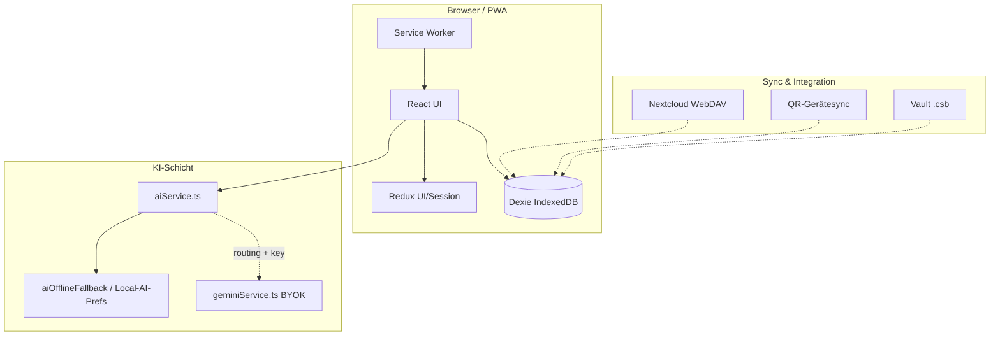

# CulinaSync

**Local-first Küchen-Assistentin** — Vorrat, Rezepte, Essensplan, Einkauf und **KI mit Wahl**: on-device, heuristisch offline oder optional Cloud-Gemini (BYOK).

| | |
|---|---|
| **Live (GitHub Pages)** | [qnbs.github.io/CulinaSync-de-](https://qnbs.github.io/CulinaSync-de-/) |
| **Vercel Production** | [culina-sync-de-web](https://culina-sync-de-web.vercel.app/) |
| **Version** | `0.2.4` |
| **Stack** | React 19 · Vite 8 · TypeScript (`tsgo`) · Dexie · Redux (UI) · PWA · Local-AI-Routing |

[Architektur](./docs/ARCHITECTURE.md) · [Entwicklung](./docs/DEVELOPMENT.md) · [Deployment](./docs/DEPLOYMENT.md) · [PWA](./docs/PWA.md) · [Local AI](./docs/LOCAL-AI-ARCHITECTURE.md) · [Design-System](./docs/DESIGN-SYSTEM.md) · [Testing](./docs/TESTING.md) · [Roadmap](./ROADMAP.md)

---

## Warum CulinaSync?

CulinaSync ist keine generische SaaS-App, sondern eine **verlässliche Haushalts-PWA**: Domain-Daten liegen bei dir (IndexedDB), die Oberfläche ist für Alltag und Küche gebaut, und KI ist **optional und steuerbar** — Local-first-Routing, heuristische Offline-Fallbacks oder Gemini nur mit deinem eigenen API-Key (nie im Build).



---

## Aktueller Stand (Juni 2026)

Snapshot: **[docs/STATUS-2026-06-03.md](./docs/STATUS-2026-06-03.md)** · Änderungen: [CHANGELOG.md](./CHANGELOG.md)

| Bereich | Stand |
|---------|--------|
| **Tests** | 380+ Vitest-Tests; Coverage v8 ~79 % lines (Schwellen 77/79/72/62) |
| **i18n** | de/en; `core` · `settings` · `features` · `gemini` · **`aiChef`**; Baseline-Scan **0** Hardcoded in Prod |
| **PWA** | Manifest, Share Target, Badges, SW-Update, Datei-Handler — [docs/PWA.md](./docs/PWA.md) |
| **Local AI** | 4-Layer-Stack, Routing, Ollama-URL, GPU/Modell-Prefs — [docs/LOCAL-AI-ARCHITECTURE.md](./docs/LOCAL-AI-ARCHITECTURE.md) |
| **Help** | 12 FAQs, Pro-Tipps, Einstellungs-Deep-Links, Live-Systemstatus |
| **Einstellungen** | 12 Bereiche + Kontext-Intros (`SettingsPanelIntro`) |
| **Sync** | QR-Gerät, verschlüsselter Vault, WebDAV/Nextcloud, JSON/MD/CSV/PDF |
| **CI** | validate + E2E-Smoke (Playwright **v1.60.0**) + CodeQL; Deploy Pages + Vercel |

---

## Kernfunktionen

| Feature | Kurzbeschreibung |
|---------|------------------|
| **Vorrat** | Ablaufdaten, Filter, Smart-Input, automatischer Rezept-Abgleich (Dexie-Hooks) |
| **Rezeptbuch** | Detail, Zutaten-Matching, Export (PDF/CSV lazy) |
| **Essensplan** | Woche, Vorrat-Balken (grün/gelb/rot), Einkauf-Anbindung |
| **Einkaufsliste** | Kategorien, Sprach-/Smart-Input, `useLiveQuery` |
| **KI-Chef** | Ideen & Rezepte über `aiService` — Local / Cloud / Offline-Fallback |
| **Local AI** | Einstellungen: 4 Layer, Routing, WebGPU, Cache, Vision, Embeddings, **Ollama** |
| **PWA** | Offline, Install, Share→Chef, Datei-Launch, App-Badge |
| **Sync & Backup** | LWW-Merge, QR, Nextcloud, Factory-Reset |
| **Sprache** | TTS, Browser-STT oder Whisper lokal; Kochmodus-Befehle |
| **Policies** | Allergene, Blacklist, Mindest-Vorrat, strikte Durchsetzung |
| **Health Connect** | Nährwert-Export (Apple/Google/Samsung) — rein lokal berechnet |
| **Community** | Opt-in IPFS/Nostr Rezept-Sharing |
| **Hilfe** | Wissensdatenbank, Tour erneut starten, Schnellzugriff Einstellungen |

---

## Local AI — Überblick

CulinaSync trennt **Daten** (immer lokal in Dexie) von **Inferenz** (konfigurierbar). Die Zielarchitektur ist ein **4-Layer-Stack**; heute aktiv sind vor allem **Routing**, **Einstellungen** und **heuristische Offline-KI** (`aiOfflineFallback`), Cloud optional über Gemini.

| Layer | Technologie (Roadmap / Prefs) | Heute |
|-------|------------------------------|--------|
| **L1** | WebLLM (WebGPU) | Modell-Prefs in Einstellungen |
| **L2** | ONNX Runtime Web (Vision) | Toggle Vision + EXIF-Stripping |
| **L3** | Transformers.js (Embeddings) | Toggle Embeddings / RAG-Chunks |
| **L4** | Heuristik / Templates | **Aktiv** — `aiOfflineFallback`, Einkauf, Rezept-Ideen |

### Routing & Facade

Alle KI-Aufrufe aus Features laufen über **`apps/web/src/services/aiService.ts`** (nicht direkt `geminiService.ts`):

| Modus | Verhalten |
|-------|-----------|
| **local-first** | Zuerst Local/Heuristik; Cloud nur mit API-Key und erlaubtem Fallback |
| **local-only** | Kein Gemini; nur Local/Offline |
| **cloud-first** | Gemini bevorzugt; bei Fehler Offline-Fallback |

Einstellungen → **Lokale KI**: Aktivierung, Local-only, Cloud-Fallback, GPU-Tier, bevorzugtes Modell, parallele Jobs, Inferenz-Cache (TTL), Speicherlimit, **Ollama** (URL z. B. `http://127.0.0.1:11434`).

```text
KI-Chef / Einkauf
       ↓
  aiService.ts          ← einziger Feature-Einstieg
       ↓
 shouldPreferLocalAi?  → aiOfflineFallback (L4)
       ↓
 shouldAllowCloudAi?   → geminiService.ts (BYOK, Zod)
       ↓
 Fehler/Offline        → aiOfflineFallback
```

**Paket:** `packages/ai-core` — Worker-Bus, Sanitize, Local-AI-Facade (Phase 1+). Doku: [LOCAL-AI-ARCHITECTURE.md](./docs/LOCAL-AI-ARCHITECTURE.md) · Audit: [LOCAL-AI-AUDIT-2026-06.md](./docs/LOCAL-AI-AUDIT-2026-06.md).

**Gemini (Cloud):** Weiterhin nur `geminiService.ts`, strukturierte Antworten mit Zod — API-Key in `apiKeyService.ts` (verschlüsselt, IndexedDB).

---

## Einstellungen & Hilfe

### 12 Einstellungsbereiche

| Bereich | Inhalt |
|---------|--------|
| Design | Akzent, Kitchen-Modus, A11y, Live-Vorschau |
| Haushalt & Sprache | Name, de/en, Wochenstart, Portionen |
| Haushalt & Module | Vorrat, Rezepte, Einkauf, Planer, Kochmodus |
| KI-Chef | Kreativität, Ernährung, Küchen, RAG-Kontext |
| **Lokale KI** | 4-Layer, Routing, GPU, Modelle, Ollama, Cache |
| Policies | Allergene, Blacklist, Mindestbestand |
| Privatsphäre | KI-Spuren, Logs, Local-First-Hinweise |
| Sprache & Audio | TTS, Whisper, Dauerhören |
| API-Schlüssel | Gemini BYOK |
| Health Connect | Export-Formate |
| Community | IPFS/Nostr (opt-in) |
| Daten & Speicher | PWA, Backup, Vault, Sync, Reset |

Jeder Bereich zeigt ein **Kontext-Intro** mit Kurztipps (`SettingsPanelIntro`). Aus der **Hilfe** springst du per Deep-Link (`focusTarget`) direkt in den passenden Bereich.

### Wissensdatenbank (Hilfe)

- **12 FAQs** — Local-first, KI-Datenschutz, API-Key, Local AI, Sync (QR/Vault/Cloud), Policies, PWA, Backups, Sprache
- **Pro-Tipps** — Palette, API-Key, Audio, Einkauf, Essensplaner, KI-Chef, **Onboarding-Tour erneut**
- **Live-Status** — Netzwerk, Speicher-Schätzung, PWA installiert, IndexedDB

---

## Monorepo-Struktur

| Pfad | Rolle |
|------|--------|
| `apps/web/` | PWA (Vite, React, Dexie, Features) — **Hauptanwendung** |
| `packages/ai-core/` | KI-Typen, Worker-Bus, Local-AI-Facade, Prompt-Sanitize |
| `packages/ui/` | Design-Tokens (`tokens.css`) |
| `src-tauri/` | Tauri-2-Desktop-Workspace |
| `apps/web/src/locales/{de,en}/` | `core.json`, `settings.json`, `features.json`, `gemini.json`, **`aiChef.json`** |
| `.github/workflows/` | CI, Deploy, E2E, CodeQL, Tauri-Release |
| `docs/` | Architektur, Local AI, PWA, Status-Snapshots |

**Einstieg:** `apps/web/index.tsx` · **DB:** nur `apps/web/src/services/db.ts` + Repositories.

---

## Tech-Stack

| Schicht | Technologie |
|---------|-------------|
| UI | React 19, Tailwind 4, Lucide, Design-System (`components/ui/`) |
| Build | Vite 8, Turbo, pnpm 11 |
| Typen | TypeScript + **`tsgo`** |
| Daten | Dexie 4 / IndexedDB (Source of Truth) |
| UI-State | Redux Toolkit; Zustand (transiente UI); redux-persist (Settings) |
| KI Cloud | `@google/genai` in `geminiService.ts`, Zod |
| KI Local | `aiService.ts` + `aiOfflineFallback` + `packages/ai-core` |
| Tests | Vitest 4, Testing Library, MSW, Playwright |
| PWA | vite-plugin-pwa, Workbox (`src/sw.ts`) |
| CI | Node 24, GitHub Actions, Pages, Vercel |

---

## Schnellstart

### Voraussetzungen

- **Node.js 24**
- **pnpm 11+** (`packageManager`: `pnpm@11.13.0`)

### Installation & Dev

```bash
pnpm install
pnpm run dev
```

Lokal: `http://localhost:5173` · Production-Pfad: `/CulinaSync-de-/`

### Local AI lokal testen

1. App starten → **Einstellungen → Lokale KI** → aktivieren, Routing `local-first` oder `local-only`.
2. Optional **Ollama** auf dem Rechner starten und URL eintragen (für Phase-1-Anbindung vorbereitet).
3. **KI-Chef** ohne API-Key: heuristische Rezept-Ideen aus Vorrat/Kontext.
4. Mit API-Key: Gemini unter **API-Schlüssel**; Routing `cloud-first` oder Fallback erlauben.

### Wichtige Befehle

| Befehl | Zweck |
|--------|--------|
| `pnpm run lint` | ESLint |
| `pnpm run type-check` | **tsgo** |
| `pnpm run test` | Vitest |
| `pnpm run test:coverage` | Coverage + Thresholds |
| `pnpm run build` | Production-Build |
| `pnpm run test:e2e` | Playwright (Preview in CI) |
| `pnpm run check:all` | Volle Validierung vor Release |
| `pnpm run i18n:check` | Locale-Parität + Baseline |

Einzeltest: `pnpm --filter web exec vitest run src/path/to/file.test.ts`

Details: [docs/DEVELOPMENT.md](./docs/DEVELOPMENT.md) · Agenten: [.github/copilot-instructions.md](./.github/copilot-instructions.md)

---

## Architektur-Regeln (kurz)

1. **Dexie:** Keine `db.table()` in Komponenten — nur Repositories / `db.ts`.
2. **Gemini:** Nur `geminiService.ts`; Features nutzen **`aiService.ts`**.
3. **API-Key:** Nie `VITE_*` im Build; `apiKeyService.ts` (IndexedDB).
4. **Redux:** UI/Session only; Domain in Dexie.
5. **Modals:** `useModalA11y`, `role="dialog"`.
6. **Fehler:** `logAppError()`; `GlobalErrorBoundary` für Render.

Mehr: [docs/ARCHITECTURE.md](./docs/ARCHITECTURE.md) · [PRD.md](./PRD.md)

---

## Deployment & Hosting

| Ziel | URL | Trigger |
|------|-----|---------|
| **GitHub Pages** | [qnbs.github.io/CulinaSync-de-](https://qnbs.github.io/CulinaSync-de-/) | Push `main` → `deploy.yml` |
| **Vercel** | [culina-sync-de-web](https://culina-sync-de-web.vercel.app/) | Push `main` (Git-Integration) |
| **Tauri** | — | [tauri-release.yml](./.github/workflows/tauri-release.yml) |

Handbuch: **[docs/DEPLOY-PAGES-VERCEL.md](./docs/DEPLOY-PAGES-VERCEL.md)** · Checks: `pnpm run verify:deploy` · `apps/web/vercel.json`

Nach Push auf `main`: CI-, E2E- und Deploy-Workflows bis **grün** beobachten.

---

## Qualität & Security

- **validate.yml:** Lint, tsgo, Tests, Coverage, Build, Audit, Bundle-Budget.
- **E2E-Smoke:** Playwright `v1.61.1-noble`, inkl. Navigation + Offline-Banner.
- **CodeQL** · **pnpm audit** (high+).
- [SECURITY.md](./SECURITY.md) · [docs/SECURITY-AUDIT-2026.md](./docs/SECURITY-AUDIT-2026.md)

---

## Dokumentation (Index)

| Dokument | Inhalt |
|----------|--------|
| [docs/README.md](./docs/README.md) | Doku-Hub |
| [docs/STATUS-2026-06-03.md](./docs/STATUS-2026-06-03.md) | Projektstand |
| [docs/LOCAL-AI-ARCHITECTURE.md](./docs/LOCAL-AI-ARCHITECTURE.md) | **4-Layer Local AI, Phase 1–4** |
| [docs/LOCAL-AI-AUDIT-2026-06.md](./docs/LOCAL-AI-AUDIT-2026-06.md) | Phase-0-Audit |
| [docs/PWA.md](./docs/PWA.md) | PWA, Share, SW |
| [docs/DESIGN-SYSTEM.md](./docs/DESIGN-SYSTEM.md) | UI-Kit |
| [docs/DEPLOYMENT.md](./docs/DEPLOYMENT.md) | Pages + Vercel |
| [docs/DEPLOY-PAGES-VERCEL.md](./docs/DEPLOY-PAGES-VERCEL.md) | Pages/Vercel Handbuch + Verify-Skripte |
| [docs/TROUBLESHOOTING.md](./docs/TROUBLESHOOTING.md) | Lockfile, Deploy, E2E |
| [CHANGELOG.md](./CHANGELOG.md) | Release-Notizen |

---

## Desktop (Tauri)

Native Shell auf **Tauri 2** (`src-tauri/`). Icons: `pnpm run tauri:icons`. Build und Release: [docs/M8-TAURI-DESKTOP.md](./docs/M8-TAURI-DESKTOP.md).

**Installierbare Builds:** Nach einem Tag `v*` (z. B. `v0.2.4`) erstellt [tauri-release.yml](./.github/workflows/tauri-release.yml) einen **Draft** auf GitHub Releases (Windows `.msi`/`.exe`, macOS `.dmg`, Linux `.AppImage`/`.deb`) — dort veröffentlichen.

---

## Mitwirken

Conventional Commits (commitlint + husky). [CONTRIBUTING.md](./CONTRIBUTING.md)

---

## Lizenz

Siehe [LICENSE](./LICENSE).
