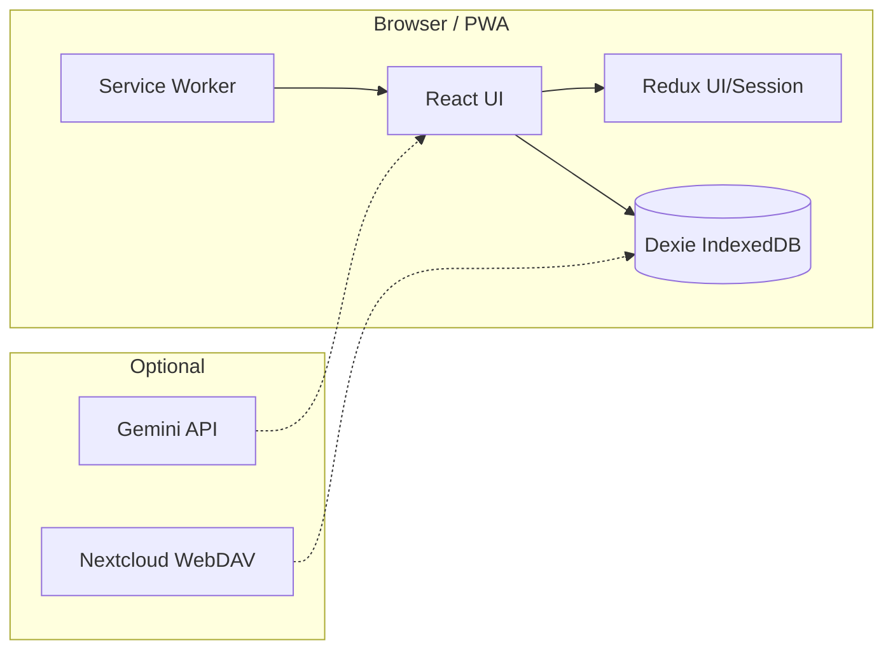

# CulinaSync

**Local-first Küchen-Assistentin** — Vorrat, Rezepte, Essensplan, Einkauf und optional KI, die im Browser bleibt und mit dir mitwächst.

| | |
|---|---|
| **Live (GitHub Pages)** | [qnbs.github.io/CulinaSync-de-](https://qnbs.github.io/CulinaSync-de-/) |
| **Vercel Preview / Production** | [culina-sync-de-web](https://culina-sync-de-web-qnbs-projects.vercel.app) (Monorepo-Deploy bei Push auf `main`) |
| **Version** | `0.2.2` |
| **Stack** | React 19 · Vite 8 · TypeScript (`tsgo`) · Dexie · Redux (UI) · PWA |

[Architektur](./docs/ARCHITECTURE.md) · [Entwicklung](./docs/DEVELOPMENT.md) · [Deployment](./docs/DEPLOYMENT.md) · [PWA](./docs/PWA.md) · [Design-System](./docs/DESIGN-SYSTEM.md) · [Testing](./docs/TESTING.md) · [Roadmap](./ROADMAP.md) · [Beitragen](./CONTRIBUTING.md)

---

## Warum CulinaSync?

CulinaSync ist keine generische SaaS-App, sondern eine **verlässliche Haushalts-PWA**: Daten liegen bei dir (IndexedDB), die Oberfläche ist für Alltag und Küche gebaut, und KI ist **optional** — nur mit deinem eigenen Gemini-Key, nie im Build eingebettet.



---

## Aktueller Stand (Juni 2026)

Vollständiger Snapshot: **[docs/STATUS-2026-06-03.md](./docs/STATUS-2026-06-03.md)** · Vorgänger: [STATUS-2026-06-02.md](./docs/STATUS-2026-06-02.md)

| Bereich | Stand |
|---------|--------|
| **Tests** | 380+ Vitest-Tests; Coverage v8 ~78 % stmts / ~79 % lines (PRD M5 erfüllt) |
| **i18n** | Deutsch + Englisch; Gates `pnpm run i18n:check` (Baseline 0 Hardcoded im Prod-Scan) |
| **PWA** | Erweitertes Manifest, Share Target, Badges, kontrolliertes SW-Update — [docs/PWA.md](./docs/PWA.md) |
| **Sync** | Geräte-QR, Cloud-Backup, **Nextcloud WebDAV** (M10.2) |
| **Desktop** | Tauri-2-Workspace vorbereitet — [docs/M8-TAURI-DESKTOP.md](./docs/M8-TAURI-DESKTOP.md) |
| **UI** | Design-System-Kit (`apps/web/src/components/ui/`) — [docs/DESIGN-SYSTEM.md](./docs/DESIGN-SYSTEM.md) |
| **CI** | `validate.yml` + E2E-Smoke + CodeQL; Deploy GitHub Pages + Vercel bei `main` |

Änderungshistorie: [CHANGELOG.md](./CHANGELOG.md)

---

## Kernfunktionen

| Feature | Kurzbeschreibung |
|---------|------------------|
| **Vorrat** | Ablaufdaten, Filter, Smart-Input, automatischer Rezept-Abgleich (Dexie-Hooks) |
| **Rezeptbuch** | Detailansicht, Zutaten-Matching, Export (PDF/CSV lazy) |
| **Essensplan** | Wochenübersicht, Querverknüpfung zu Rezepten und Einkauf |
| **Einkaufsliste** | Kategorien, Sprach-/Smart-Input, reaktiv via `useLiveQuery` |
| **KI-Chef** | Gemini mit Zod-validiertem JSON; Local-AI-Routing in Einstellungen |
| **PWA** | Offline-Grundlage, Install, Share-to-Chef, Datei-Launch, App-Badge |
| **Sync & Backup** | LWW-Merge, QR-Gerätesync, optional Nextcloud |
| **Barrierefreiheit** | Modals mit Fokus-Falle, `role="dialog"`, reduzierte Bewegung / kompakte Dichte |

---

## Monorepo-Struktur

| Pfad | Rolle |
|------|--------|
| `apps/web/` | PWA (Vite, React, Dexie, Features) — **Hauptanwendung** |
| `packages/ai-core/` | Geteilte KI-Typen / Hilfen |
| `packages/ui/` | Design-Tokens (`tokens.css`) |
| `src-tauri/` | Tauri-2-Desktop-Workspace (Cargo) |
| `.github/workflows/` | CI, Deploy, E2E, CodeQL, Tauri-Release |
| `docs/` | Architektur, Betrieb, Status-Snapshots |
| `graphify-out/` | Codebase-Graph (siehe [CLAUDE.md](./CLAUDE.md)) |

App-Einstieg: **`apps/web/index.tsx`** (nicht Repo-Root). Alle DB-Schreibzugriffe nur über **`apps/web/src/services/db.ts`** und Repositories.

---

## Tech-Stack

| Schicht | Technologie |
|---------|-------------|
| UI | React 19, Tailwind 4, Lucide |
| Build | Vite 8, Turbo, pnpm 10 |
| Typen | TypeScript 6 + **`tsgo`** (nativer Type-Check) |
| Daten | Dexie 4 / IndexedDB (Source of Truth) |
| UI-State | Redux Toolkit + redux-persist (nur Settings) |
| KI | `@google/genai` nur in `geminiService.ts`, Zod-Schemas |
| Tests | Vitest 4, Testing Library, MSW, Playwright (E2E) |
| PWA | vite-plugin-pwa, Workbox (`injectManifest`, `src/sw.ts`) |
| CI | Node 24, GitHub Actions, GitHub Pages, Vercel |

---

## Schnellstart

### Voraussetzungen

- **Node.js 24** (`.node-version`, CI, DevContainer)
- **pnpm 10+** (`packageManager` in `package.json`)

### Installation & Dev

```bash
pnpm install
pnpm run dev          # Turbo → apps/web (Vite)
```

Öffnen: `http://localhost:5173` (lokal `base: /`).

### Wichtige Befehle

| Befehl | Zweck |
|--------|--------|
| `pnpm run lint` | ESLint (Monorepo) |
| `pnpm run type-check` | **tsgo** (nicht `tsc` für Builds) |
| `pnpm run test` | Vitest (alle Packages) |
| `pnpm run test:coverage` | Coverage + Thresholds |
| `pnpm run build` | `tsgo` + Vite Production |
| `pnpm run test:e2e` | Playwright gegen `vite preview` |
| `pnpm run check:bundle-budget` | Bundle-Limits |
| `pnpm run check:all` | Volle Pre-Push-Validierung |
| `pnpm run i18n:check` | Locale-Parität + Baseline |

Einzeltest: `pnpm --filter web exec vitest run src/path/to/file.test.ts`

Details: [docs/DEVELOPMENT.md](./docs/DEVELOPMENT.md) · Agenten-Kanon: [.github/copilot-instructions.md](./.github/copilot-instructions.md)

---

## Architektur-Regeln (kurz)

Diese Grenzen sind bewusst streng — sie halten die App wartbar und sicher:

1. **Dexie:** Keine direkten `db.table()`-Aufrufe in Komponenten; nur Repositories / `db.ts`.
2. **Gemini:** Nur `apps/web/src/services/geminiService.ts`; AI-JSON immer mit Zod prüfen.
3. **API-Key:** Nie `VITE_*` / `process.env` im Client-Build; Speicherung über `apiKeyService.ts` (verschlüsselt in IndexedDB).
4. **Redux:** Nur UI/Session; Domain-Daten nicht in Redux spiegeln.
5. **Modals:** `useModalA11y`, `role="dialog"`, `aria-modal`.
6. **Fehler:** `logAppError()`; Thunk-Fehler → Listener-Middleware; Render-Fehler → `GlobalErrorBoundary`.

Mehr: [docs/ARCHITECTURE.md](./docs/ARCHITECTURE.md) · [PRD.md](./PRD.md)

---

## Deployment & Hosting

| Ziel | Trigger | Artefakt / URL |
|------|---------|----------------|
| **GitHub Pages** | Push `main` → `deploy.yml` | `apps/web/dist`, Base `/CulinaSync-de-/` |
| **Vercel** | GitHub-Integration | Turbo-Build `web`; Output `apps/web/dist` (Dashboard-Root) |
| **Tauri** | `workflow_dispatch` | [tauri-release.yml](./.github/workflows/tauri-release.yml) |

Vercel-Hinweis: Kein Root-`vercel.json` nötig, wenn das Projekt im Dashboard auf **`apps/web`** zeigt — andernfalls sucht die Plattform `dist` am falschen Pfad. Siehe [docs/DEPLOYMENT.md](./docs/DEPLOYMENT.md).

---

## Qualität, Security & Observability

- **Lint + Typecheck + Tests + Build + Audit** in `validate.yml` (wiederverwendbar für CI und Deploy).
- **E2E-Smoke:** Playwright im Container `mcr.microsoft.com/playwright:v1.60.0-noble` ([e2e-smoke.yml](./.github/workflows/e2e-smoke.yml)).
- **CodeQL** für JS/TS.
- **Bundle-Budget** und **pnpm audit --audit-level=high**.
- **Security:** [SECURITY.md](./SECURITY.md) · Review: [docs/SECURITY-AUDIT-2026.md](./docs/SECURITY-AUDIT-2026.md)

Nach jedem Push auf `main`: CI-/Deploy-/CodeQL-Läufe beobachten bis grün (Team-Konvention).

---

## Dokumentation (Index)

| Dokument | Inhalt |
|----------|--------|
| [instructions.md](./instructions.md) | Gates & Checklisten für Menschen und Agenten |
| [PRD.md](./PRD.md) | Scope, FR/NFR, Akzeptanzkriterien |
| [docs/README.md](./docs/README.md) | Dokumentations-Hub |
| [docs/STATUS-2026-06-03.md](./docs/STATUS-2026-06-03.md) | **Aktueller** Projektstand |
| [docs/PWA.md](./docs/PWA.md) | Manifest, SW, Install, Share |
| [docs/DESIGN-SYSTEM.md](./docs/DESIGN-SYSTEM.md) | UI-Kit, Tokens, Migrationen |
| [docs/LOCAL-AI-ARCHITECTURE.md](./docs/LOCAL-AI-ARCHITECTURE.md) | Local-AI-Roadmap |
| [docs/TROUBLESHOOTING.md](./docs/TROUBLESHOOTING.md) | Häufige Fehler (inkl. Lockfile / Vercel) |
| [CHANGELOG.md](./CHANGELOG.md) | Release-Notizen (Keep a Changelog) |

---

## Desktop (Tauri)

Native Wrapper auf Basis **Tauri 2** (`src-tauri/`). Icons: `pnpm run tauri:icons`. Vollständige Release-Matrix folgt Roadmap M8.

---

## Mitwirken

Conventional Commits (commitlint + husky). Ablauf und Erwartungen: [CONTRIBUTING.md](./CONTRIBUTING.md).

---

## Lizenz

Siehe [LICENSE](./LICENSE).
