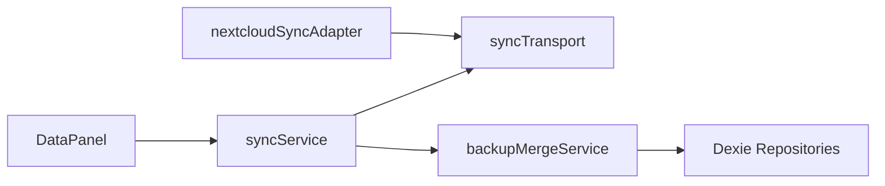
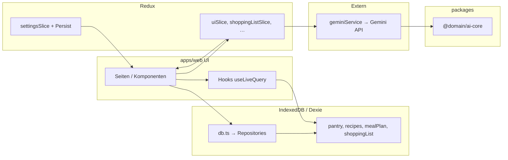

# Architektur

> **Stand:** 2026-05-16 — Monorepo (`apps/web`, `packages/*`)

## Zielbild

CulinaSync ist eine local-first PWA. Persistente Domaindaten werden im Browser gespeichert und reaktiv gelesen. Netzwerk- oder KI-Funktionen sind Zusatzfähigkeiten, nicht die Grundlage der Kernbedienung.

## Monorepo-Überblick

| Paket | Pfad | Rolle |
|-------|------|--------|
| **web** | `apps/web/` | React 19 + Vite 8 PWA (UI, Dexie, Redux, Gemini) |
| **@domain/ai-core** | `packages/ai-core/` | Shared AI-Hilfen (Prompt-Sanitisierung, Worker-Bus, optionale ML-Imports) |
| **@domain/ui** | `packages/ui/` | Design-Tokens und Tailwind-Preset |
| **Tauri** | `src-tauri/` | Desktop-Wrapper (dist aus `apps/web`) |

Orchestrierung: **pnpm workspaces** + **Turborepo** (`turbo.json`). Root-Scripts delegieren an `apps/web` (z. B. `pnpm run dev` → `turbo run dev --filter=web`).

## Schichten (Web-App)

### UI-Schicht

- `apps/web/index.tsx` initialisiert Redux Store (Legacy-Settings-Migration), i18n, Provider und Persist Gate.
- `apps/web/src/App.tsx` verwaltet Seitenwechsel, globale Bedienelemente, Lazy Loading und Shell-Zustand.
- `apps/web/src/components/` enthält Seitenkomponenten sowie Feature-Unterordner.

### UI-/Session-State

- Redux Toolkit unter `apps/web/src/store/`.
- Redux dient primär für UI- und Session-Zustand (Navigation, Fokus, Voice, Slice-Async).
- Persistiert wird nur der `settings`-Slice (`indexedPersistStorage` / Dexie-Hilfen wo dokumentiert).

### Persistente Domaindaten

- Dexie/IndexedDB = Source of Truth für `pantry`, `recipes`, `mealPlan`, `shoppingList`. Schema-Versionen und Upgrades: [DB-MIGRATIONS.md](./DB-MIGRATIONS.md).
- Lesen: `useLiveQuery` in domainnahen Hooks.
- Schreiben: Repositories und Services — **nicht** direkt aus Komponenten.

### Services und Integrationen

- `apps/web/src/services/db.ts` — DB-Einstieg und Repositories.
- `apps/web/src/services/geminiService.ts` — einzige Gemini-Fassade; Zod nach `JSON.parse`.
- `packages/ai-core` — von `geminiService` genutzte Shared-Utilities (Build vor Web-Typecheck in CI).
- `apps/web/src/services/exportService.ts`, `voiceCommands.ts`, …

### Lokalisierung

- `apps/web/src/i18n.ts` und `apps/web/src/locales/{de,en}/` (`core`, `settings`, `features`).

## Datenfluss

1. UI triggert Handler in Komponente, Hook oder Slice.
2. Persistente Operationen über Repository-/Service-Funktionen.
3. Dexie → IndexedDB.
4. Hooks lesen via `useLiveQuery` und aktualisieren die UI.
5. Redux für Shell-, Fokus-, Modal- und Prozesszustand.

### Sync & Backup (optional)

- **Cloud:** `syncService` + `syncTransport` (PUT/GET); Provider **generic URL** oder **Nextcloud** (`nextcloudSyncAdapter` → WebDAV `remote.php/dav/files/…`).
- **Gerät:** `deviceSyncService` (QR/Text, LWW via `backupMergeService`).
- **Vault:** `.csb` AES-GCM (`snapshotVaultService`).

### Diagramm (Überblick)

## Interaktionsmuster

- Destructive Aktionen über modale Flows (kein `window.confirm` in Kernfeatures).
- Essensplan: `MealPlannerProvider` + `useMealPlannerScreen` (analog Pantry/Einkauf).
- Kochmodus: `useCookModeController` + `cook-mode/*`.
- Voice: `processCommand` → `executeVoiceAction`.

## CI/CD (Kurz)

Wiederverwendbarer Workflow [`.github/workflows/validate.yml`](../.github/workflows/validate.yml):

`install` → `lint` → `type-check` (tsgo; **abhängig von `^build` für Workspace-Packages**) → `test:coverage` → `build` → `bundle-budget` → `pnpm audit --audit-level=high` → Playwright-Smoke → optional Pages-Artefakt.

Lokal: `pnpm run check:all` (lint, type-check, test, test:scripts, i18n, build, budget, audit).

## Weiterführend

- [PROJECT-STRUCTURE.md](./PROJECT-STRUCTURE.md) — Ordner und Verantwortlichkeiten
- [DEVELOPMENT.md](./DEVELOPMENT.md) — Setup und Befehle
- [TESTING.md](./TESTING.md) — Tests und Coverage
- [DEPLOYMENT.md](./DEPLOYMENT.md) — Pages, Tauri-Prep
- [STATUS-2026-05-16.md](./STATUS-2026-05-16.md) — aktueller Snapshot
