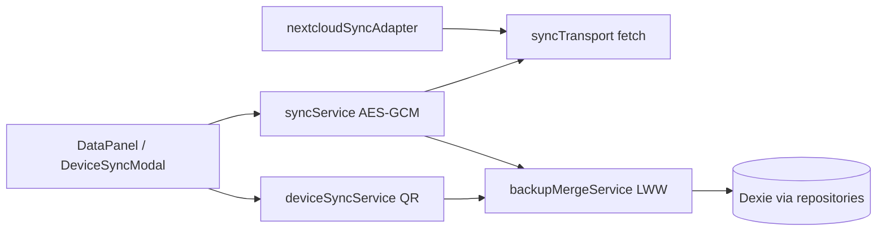

# CulinaSync-de- — Full-Scale Audit vNext

> **Datum:** 2026-06-03 (Snapshot) · **Aktualisierung Metriken:** 2026-06-04 (`main` @ `1b82f3b`, PR #66 + #67)  
> **Scope:** Code, Architektur, Security, Local AI, Sync, i18n, Testing, CI/CD, Tauri, DX, Dokumentation  
> **Basis-Commit (Snapshot):** `main` @ `ae302be` (nach PR #57) — Findings teils durch #66/#67 geschlossen  
> **Aktueller Stand:** [`STATUS-2026-06-03.md`](./STATUS-2026-06-03.md) · [`AUDIT-REMEDIATION-BACKLOG.md`](./AUDIT-REMEDIATION-BACKLOG.md)  
> **Methodik:** Exploration → `pnpm run type-check`, `test:coverage`, `i18n:check`, `analyze:bundle`, `pnpm audit`, Deep-Dive `apps/web/src`, Cross-Ref PRD/ROADMAP/STATUS/AUDIT.md

---

## Executive Summary

| Dimension | Bewertung | Kurzbegründung |
|-----------|-----------|----------------|
| **Gesamt** | **9,0 / 10** | Reife Local-First-PWA mit vorbildlicher Doku, CI und Privacy-Modell; verbleibende Lücken sind **abgrenzbar** (Sync-Hardening, E2E-Tiefe, Branch-Coverage, Tauri-Release). |
| **Produktionsreife (privat / Local-First)** | ✅ Hoch | Dexie + Repositories, BYOK-Gemini, PWA, ~79 % Line-Coverage, grüne Gates. |
| **Multi-Device / öffentlicher Launch** | ⚠️ Mittel | Sync LWW + WebDAV/QR **ohne** vollständige E2E-/Property-Tests; Credentials-UX verbesserungsfähig. |
| **Sicherheit** | ✅ Stark | Kein API-Key im Build; AES-GCM-Backups; Zod bei Gemini; **keine** Critical/High in `pnpm audit --audit-level=high`. |

**Wichtig:** Externe Audits (Juni 2026) mit Coverage ~59–61 % sind **veraltet**. Aktuell (`main` nach PR #67, Node 24):

| Metrik | Ist | Threshold (CI) | PRD M5 / M5.8 |
|--------|-----|----------------|---------------|
| Tests | **470** Vitest (+5 scripts) | — | ✅ |
| Statements | **~79,6 %** | 80 % | ✅ |
| Lines | **~81,1 %** | 78 % | ✅ |
| Functions | **~75,1 %** | 73 % | ✅ |
| Branches | **~64,0 %** | 64 % | ✅ M5.8 |
| E2E | **10** / **6** Specs | — | ✅ R-003 |

---

## Baseline-Validierung (2026-06-03)

| Check | Ergebnis | Evidence |
|-------|----------|----------|
| `pnpm run type-check` | ✅ | tsgo, Turbo cache hit |
| `pnpm run test:coverage` | ✅ | 404 passed (Vitest) |
| `pnpm run i18n:check` | ✅ | Parität de/en; Baseline **0** Hardcodes |
| `pnpm audit --audit-level=high` | ✅ (0 high/critical) | 4 findings total: 1 low, 3 moderate |
| `pnpm run analyze:bundle` | ✅ | Budget eingehalten; `vendor-export` ~623 KB brotli größter Chunk |
| `cargo check` (Tauri) | ⚠️ lokal | Fehlt `gdk-3.0` im Agent-Image; CI-Matrix `tauri-release.yml` separat |

---

## Findings nach Severity

### Critical — 0

Keine bekannten Datenverlust-, Secret-Leak- oder Build-Blocker auf `main`.

---

### High

#### H1 — Sync-Payload & QR-Transfer ohne Schema-Validierung

| Feld | Inhalt |
|------|--------|
| **Evidence** | `deviceSyncService.ts`: `JSON.parse` + Typ-Assertion; keine Zod-Grenzen für Array-Länge/Felder |
| **Impact** | Korrupte oder böswillige QR-Payloads können Merge-Pfad stressen / unerwartete DB-Writes |
| **Root cause** | Schnelle M10-Implementierung; Parität zu Gemini-Zod-Pattern fehlt |
| **Fix** | `deviceSyncPayloadSchema` (Zod) in `parseDeviceSyncTransferString`; Max-Längen an `MAX_ITEMS_PER_TABLE` koppeln |
| **Status** | 🔧 Fix in diesem Audit-PR vorgesehen |

#### H2 — `DataPanel.tsx` Monolith (~642 Zeilen)

| Feld | Inhalt |
|------|--------|
| **Evidence** | Sync-UI, Vault, Export, Device-QR, Nextcloud in einer Datei |
| **Impact** | Review-Risiko, schwer testbare UI-Zweige, Bundle `Settings-*.js` ~98 KB |
| **Fix** | Feature-Split: `SyncProviderSection.tsx`, `VaultSection.tsx`, `DeviceSyncSection.tsx`; Logik in `useDataPanelSync.ts` |
| **Effort** | Mittel (4–8 h) |

#### H3 — E2E nur Smoke (1 Spec + Offline-Spec)

| Feld | Inhalt |
|------|--------|
| **Evidence** | `e2e/smoke.spec.ts`, `navigation-offline.spec.ts`; kein Sync-/Chef-/Cook-Mode-Flow |
| **Impact** | Regressionen bei Multi-Device und kritischen Journeys werden spät entdeckt |
| **Fix** | Playwright-Suite: `sync-nextcloud.spec.ts` (mock WebDAV), `chef-offline.spec.ts`, `cook-mode.spec.ts` mit `seedDismissedAppModals` |
| **Effort** | Hoch (8–16 h) |

---

### Medium

#### M1 — Import-/Side-Effect-Kette um `db.ts` (teilweise behoben)

| Feld | Inhalt |
|------|--------|
| **Evidence** | Aufspaltung: `dbInstance.ts`, `dbMigrations.ts`, `db.ts` (Hooks). `pantryMatcherService` → `dbInstance` ✅. **`exportService.ts` importiert noch `./db`** → zieht Populate/Hooks in Tests |
| **Impact** | Schwere Mocks in Service-Tests; historisch „Zyklus“-Meldung in AUDIT.md |
| **Fix** | Services nur `dbInstance`; **nur** App-Bootstrap importiert `db.ts` einmal (`index.tsx` o.ä. prüfen) |
| **Status** | 🔧 `exportService` → `dbInstance` in Audit-PR |

#### M2 — `react-hooks/exhaustive-deps` (erledigt: **error**)

| Feld | Inhalt |
|------|--------|
| **Evidence** | `eslint.config.js`; **keine** `eslint-disable` in `src/` |
| **Impact** | Stale Closures — mit **`error`** + `--max-warnings 0` abgesichert (2026-06-03, PR #64) |
| **Fix** | ~~Warnungs-Nullung → `error`~~ **Erledigt**; Follow-up: typed ESLint (R-005) |

#### M3 — Branch-Coverage (~~offen~~ → **erledigt** M5.8)

| Feld | Inhalt |
|------|--------|
| **Evidence** | PR #67: Ist **~64,0 %** branches; Vitest-Threshold **64** in `vitest.config.ts` |
| **Fix** | ~~Weitere Tests~~ **Erledigt**; langfristig ROADMAP M5.9 → **88 %** |

#### M4 — Dexie-Migrationen existieren — Doku/Onboarding aktualisieren

| Feld | Inhalt |
|------|--------|
| **Evidence** | `dbMigrations.ts`: Versionen 8–12+, `ensureMigrationBackup`, Legacy-DB-Rename |
| **Impact** | Externe Audits listen „fehlende Migration“ — **faktisch falsch** |
| **Fix** | AUDIT.md / Help-FAQ: Backup vor Schema-Upgrade; Link `dbMigrations.test.ts` |

#### M5 — Sync-Credentials in `localStorage` (Server/User/Pfad)

| Feld | Inhalt |
|------|--------|
| **Evidence** | `DataPanel.tsx`: `culinaSyncNextcloudServer`, `culinaSyncNextcloudUser`, … App-Passwort **nur** React-State ✅ |
| **Impact** | XSS auf gleicher Origin könnte Metadaten lesen; Passwort nicht persistiert (gut) |
| **Fix** | Optional: verschlüsselte Credential-Box via `apiKeyService`-Pattern oder sessionStorage + Warnhinweis |

#### M6 — Lighthouse CI nicht voll integriert

| Feld | Inhalt |
|------|--------|
| **Evidence** | Kein `lighthouserc` in Repo-Root-Suche; Performance manuell |
| **Fix** | `@lhci/cli` in CI (nur PR) gegen Preview-URL; Budgets PWA/A11y |

#### M7 — Tauri 2 — Prep, kein Release

| Feld | Inhalt |
|------|--------|
| **Evidence** | `src-tauri/Cargo.toml` Tauri 2; `tauri-release.yml`; lokales `cargo check` scheitert ohne GTK |
| **Fix** | M8: Tag `v0.2.x`, Matrix-Artefakte, CSP in `tauri.conf.json` verifizieren |

---

### Low / Info

| ID | Thema | Notiz |
|----|--------|------|
| L1 | `@typescript-eslint/no-explicit-any` | **`error`** in eslint — AUDIT.md (2026-05-01) veraltet; **0** `: any` in `apps/web/src` |
| L2 | `RecipeDetail` / `CookModeView` | Bereits gesplittet (`recipe-detail/`, `cook-mode/`); Wrapper 1 / 106 Zeilen |
| L3 | `geminiService.ts` ~605 Zeilen | Akzeptabel als Facade; weitere Split optional |
| L4 | Moderate npm advisories | 3 moderate + 1 low — regelmäßig Dependabot + Overrides |
| L5 | Demo/Seed auf GitHub Pages | Optional „Try demo“ ohne echte Daten — UX für Erstbesucher |

---

## Deep Dives

### Local AI (Stand Juni 2026)

| Layer | Code | Produktstatus |
|-------|------|----------------|
| L4 Heuristik | `aiOfflineFallback.ts` | **Aktiv** |
| Routing | `aiService.ts`, `aiSettingsHelpers.ts` | local-first / local-only / cloud-first |
| L1–L3 | Prefs in `LocalAiPanel` | Roadmap / Toggles |
| Cloud | `geminiService.ts` | BYOK, Zod |

**Empfehlung:** WebLLM/ONNX-Integration nur mit Feature-Flag + Bundle-Budget-Check; E2E „chef ohne Netz“ mit MSW.

### Sync-Architektur

| Pfad | Konflikt | Tests |
|------|----------|-------|
| QR Device | LWW via `mergeBackupWithConflictResolution` | `deviceSyncService.test.ts` (2 cases) |
| WebDAV/Nextcloud | replace oder merge | `nextcloudSyncAdapter.test.ts`; **`syncService` 56 % lines** |

### Architektur-Schichten — ✅ Konform

- UI → Hooks/Context → Repositories → `dbInstance`
- Redux nur UI/Session; Dexie Source of Truth
- Gemini nur `geminiService.ts`

---

## Vergleich mit externem Audit (User-Input 3. Juni)

| Behauptung extern | Ist-Stand 2026-06-03 |
|-------------------|----------------------|
| Coverage ~59–61 % | **~79–81 %** (PR #66: Thresholds 80/78/73/63) |
| `exhaustive-deps: off` | **`error`** (seit 2026-06-03) |
| `no-explicit-any: off` | **`error`** |
| Dexie-Migration fehlt | **`dbMigrations.ts` vorhanden** |
| Import-Zyklen db.ts | **Teilweise gelöst**; Rest: `exportService` → `db` |
| RecipeDetail/CookMode monolithisch | **Refactored** |
| Keine offenen Issues | Weiterhin sauber; Backlog in Doku |

---

## Top-5 Sofort-Fixes (konkret)

1. **H1** — Zod für `DeviceSyncPayload` (dieser PR).
2. **M1** — `exportService` importiert `dbInstance` (dieser PR).
3. ~~**H3** — E2E-Spec für Settings→Sync~~ **Basis erledigt** (PR #66: `sync-settings`, `chef-local`, `pantry-cook`).
4. ~~**M2** — ESLint exhaustive-deps → `error`~~ **Erledigt** (2026-06-03).
5. ~~**H2** — `DataPanel` in Subkomponenten splitten~~ **Erledigt** (PR #66).

---

## Empfehlungen Weiterentwicklung

| Bereich | Kurzfristig | Mittelfristig |
|---------|-------------|---------------|
| **Sync** | Zod + E2E + Fehlercodes i18n | CRDT-Vorbereitung in `packages/` (M10) |
| **Tauri** | Erster Tag-Build CI | Store-Metadaten, Auto-Update-Policy |
| **Testing** | Branch-Tests Repositories/Sync | Property-Tests für `backupMergeService` |
| **DX** | PR-Review-Modus (CodeAnt) in Cursor-Regeln | `graphify update` nach Sessions |
| **Produkt** | Demo-Mode / Seed-Tour | Datenschutzerklärung DE |

---

## Referenzen

- [`AUDIT-REMEDIATION-BACKLOG.md`](./AUDIT-REMEDIATION-BACKLOG.md)
- [`AUDIT-REMEDIATION-PLAN.md`](./AUDIT-REMEDIATION-PLAN.md)
- [`STATUS-2026-06-03.md`](./STATUS-2026-06-03.md)
- [`LOCAL-AI-ARCHITECTURE.md`](./LOCAL-AI-ARCHITECTURE.md)
- Historisch: [`AUDIT-REPORT-2026-06.md`](./AUDIT-REPORT-2026-06.md), Root [`AUDIT.md`](../AUDIT.md)
