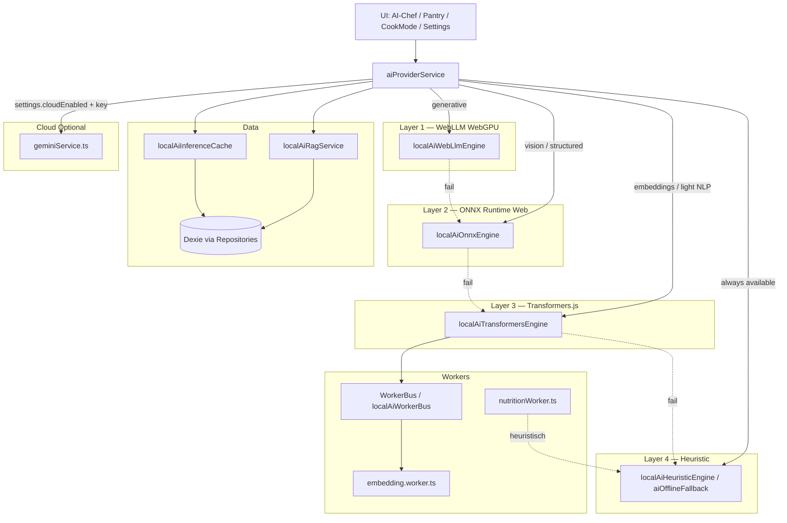

# Local AI — Zielarchitektur (CulinaSync-de-)

**Version:** 2026.06.03 (Phase 1 — M11 live, M11.4 Ergänzungen)  
**Status:** Implementiert für Kernpfade; ONNX/Vision/Cook-Mode-Assistent noch offen  
**Ziel:** Local-first kulinarische KI — tiefer integriert als CannaGuide-2025 und StoryCraft-Studio, bei gleicher 4-Layer-Philosophie.

---

## 0. Ist-Stand (Code, Juni 2026)

| Bereich | Status |
|---------|--------|
| **Routing** | `aiProviderService.ts` — Default **`local-first`** (`settingsMerge`); Cloud optional (BYOK) |
| **L1 WebLLM** | Implementiert, **opt-in** (`enableWebLlmInference: false` default) |
| **L2 ONNX** | Nicht implementiert |
| **L3 Transformers** | Embeddings live (`localAiTransformersEngine`); generative L3 = Stub (`null`) |
| **L4 Heuristik** | `aiOfflineFallback` + `runHeuristicEngine` — immer verfügbar |
| **RAG** | Hybrid semantic + keyword (`localAiRagService`); Quellen: Rezepte, Vorrat, **Essensplan** |
| **Embeddings** | Dexie v13 `aiEmbeddings`; Indexierung via DB-Hooks; **Worker** `embedding.worker.ts` + `WorkerBus` |
| **Onboarding** | `LocalAiSetupModal` — GPU-Check, Embeddings/WebLLM aktivieren |
| **WorkerBus** | `packages/ai-core/workerBus.ts` + `localAiWorkerBus.ts` (Reindex Priority 0) |

---

## 1. Vision & Prinzipien

| Prinzip | Umsetzung |
|---------|-----------|
| **Local default** | Ohne Netzwerk und ohne API-Key nutzbare KI-Features |
| **Cloud optional** | Gemini (BYOK) als Power-Layer über `geminiService.ts` |
| **Daten bleiben lokal** | RAG/Embeddings/Cache in IndexedDB; keine Domain-Daten an Cloud ohne expliziten Flow |
| **Graceful degradation** | 4 Layer mit garantiertem Layer 4 (Heuristik = bestehender `aiOfflineFallback`) |
| **Domänentiefe** | RAG über Rezepte, Vorrat, Meal-Plan, Ablaufdaten — nicht generischer Chat-Bot |
| **Stack-Konformität** | Dexie/Repositories, `serviceRegistry`, Zod, i18n, `logAppError`, Lazy Bundles |

---

## 2. 4-Layer Local Inference Stack



### Layer-Zuordnung Features

| Feature | Primär | Fallback | Cloud (optional) |
|---------|--------|----------|------------------|
| Rezept-Ideen / Rezept | L1 WebLLM | L4 Heuristic | Gemini |
| Einkaufsliste KI | L1 oder L4 | L4 | Gemini |
| Pantry-Foto | L2 ONNX/CLIP | L4 (manuell) | Gemini Vision |
| Cook-Mode Assistent | L1 (kurzer Kontext) | L4 Tipps | Gemini |
| Meal Planner | L1 + RAG | L4 Regeln | Gemini |
| Nährwert-Insights | L3 Embeddings + L4 | L4 Worker (bestehend) | Gemini Verify |
| KI-Koch-Chat | L1 + RAG | L4 | Gemini |
| Voice Antwort | L4 + später L1 | — | — |

---

## 3. Paket- & Service-Struktur

### 3.1 `packages/ai-core` (erweitern)

```
packages/ai-core/src/
  index.ts
  sanitizeForPrompt.ts          # bestehend
  workerBus.ts                  # bestehend
  localAiFacade.ts              # erweitern: bindet Engines
  optionalMlImports.ts          # bestehend
  config/
    modelRegistry.ts            # Modell-IDs, Größen, GPU-Tier-Mapping
    gpuTier.ts                  # detectGpuTier(), Empfehlungen
  providers/
    types.ts                    # AiProvider, AiTask, AiResult
    providerChain.ts            # Layer-Fallback-Kette
  engines/
    localAiWebLlmEngine.ts
    localAiOnnxEngine.ts
    localAiTransformersEngine.ts
    localAiHeuristicEngine.ts   # Wrapper um deterministische Templates
  rag/
    embeddingTypes.ts
    cosineSearch.ts             # rein funktional, keine Dexie-Imports
  cache/
    inferenceCacheTypes.ts
  workers/
    llm.worker.ts               # Message-Protokoll
    vision.worker.ts
    embedding.worker.ts
```

**Exports (geplant):**

- `.` — Facade, Bus, Sanitize, Registry-Types  
- `./ml` — optionale dynamische Imports (WebLLM, ONNX, Transformers) für Tree-Shaking  

### 3.2 `apps/web/src/services/` (neu/angepasst)

| Datei | Verantwortung |
|-------|----------------|
| `aiProviderService.ts` | **Zentrale Routing-Schicht** — Local first, Cloud optional, Settings |
| `localAiRagService.ts` | Dexie: Rezepte, Pantry, MealPlan → Chunks, Embeddings, Suche |
| `localAiInferenceCacheService.ts` | TTL-Cache für Prompt-Hashes / Embedding-IDs |
| `localAiVisionService.ts` | App-Orchestrierung Pantry-Foto → Worker → strukturierte Items |
| `aiService.ts` | **Dünn:** delegiert an `aiProviderService` (Deprecation der Cloud-first-Logik) |
| `geminiService.ts` | Unverändert als **Cloud-Backend** (BYOK, Zod) |
| `aiOfflineFallback.ts` | Wird von `localAiHeuristicEngine` / Layer 4 genutzt |

### 3.3 `serviceRegistry` — Ziel

```typescript
// AiGateway — alle Pfade über aiProviderService
ai: {
  generateRecipeIdeas: (…) => aiProviderService.generateRecipeIdeas(…),
  extractPantryItemsFromImage: (…) => aiProviderService.extractPantryFromImage(…),
  // …
}
```

Tests injizieren weiterhin Mocks über `setAppServices`.

---

## 4. Domänenspezifisches RAG

### 4.1 Datenquellen (nur über Repositories)

| Quelle | Repository / Hook | RAG-Nutzung |
|--------|-------------------|-------------|
| Rezepte | `recipeRepository` | Titel, Zutaten, Tags, Anleitungen |
| Vorrat | `pantryRepository` | Name, Menge, Kategorie, **Ablauf** |
| Essensplan | `mealPlanRepository` + Dexie-Hooks | Datum, Mahlzeit, Rezepttitel, Notiz |
| Einstellungen | Redux `settings` | Diät, Küchen, Custom Instruction |

### 4.2 Pipeline

1. **Indexierung** (debounced, nach Dexie-Write-Hooks): Chunk → `localAiRagService.indexDocument`  
2. **Embedding** (L3 Transformers, lazy): Vektor in IndexedDB-Tabelle `aiEmbeddings` (neues Schema via `db.ts` Migration)  
3. **Retrieval** (Top-K Cosine): Kontext-String für Prompt  
4. **Generierung** (L1): System-Prompt + RAG-Kontext + `sanitizeForPrompt`  
5. **Validierung:** Zod-Schemas aus `geminiSchemas` (shared re-export in `ai-core` oder `packages/ai-schemas`)

### 4.3 Unterschied zu Referenz-Apps

- **Kulinarischer Kontext:** Ablaufdaten → Meal-Planner-Prompt („verbrauche zuerst …“)  
- **Cook-Mode:** nur aktuelles Rezept + Schritt-Index (kleines Kontext-Fenster)  
- **Kein** generisches „World Knowledge“-Corpus — optional kleines statisches `foodKnowledge.json` für Einheiten/Allergene

---

## 5. Settings & Model Management UI

Neuer Settings-Bereich **„Lokale KI“** (`settings.localAi.*`):

| Einstellung | Typ | Default |
|-------------|-----|---------|
| `localAi.enabled` | boolean | `true` |
| `localAi.localOnlyMode` | boolean | `false` (wenn true: kein Gemini-Aufruf) |
| `localAi.allowCloudFallback` | boolean | `true` |
| `localAi.preferredGenerativeModel` | enum (registry) | auto by GPU tier |
| `localAi.downloadedModels` | string[] | `[]` |
| `localAi.maxConcurrentJobs` | number | hardware-based |

**UI-Elemente:**

- GPU-Tier-Anzeige (WebGPU / WASM / CPU-only)  
- Download-Fortschritt pro Modell (Worker-Events über `WorkerBus` Telemetry)  
- Speicherplatz-Hinweis  
- Button „Cache leeren“ (Inference + Embeddings)

---

## 6. Worker & Performance

| Mechanismus | Details |
|-------------|---------|
| **WorkerBus** | Bereits in `ai-core`; App übergibt `onTelemetry` → Settings-Fortschritt |
| **Prioritäten** | Cook-Mode / aktiver Screen = P3; Hintergrund-Indexierung = P0 |
| **Lazy Chunks** | `vendor-webllm`, `vendor-onnx`, `vendor-transformers` — nicht precachen (SW `globIgnores`) |
| **Tab Leader** | Optional aus StoryCraft: ein Tab lädt Modell (Phase 3) |
| **Low-End** | `gpuTier === 'low'` → skip L1, start L3/L4 |

---

## 7. Security & CSP

| Thema | Maßnahme |
|-------|----------|
| Prompt Injection | `sanitizeForPrompt` + bestehende Gemini-Patterns |
| HTML/Import | DOMPurify in `geminiService` — für lokale Web-Import-Pfade gleich halten |
| CSP | WebLLM benötigt `wasm-unsafe-eval` — **nur** wenn Local AI aktiviert und Modell geladen; in `docs/DEPLOYMENT.md` + optional Feature-Flag Meta-CSP |
| EXIF | Vision-Upload: Strip vor Inferenz (Phase 2) |
| Datenfluss | Local path: **kein** `fetch` zu Drittanbietern |

---

## 8. Phasenplan (Implementierung)

### Phase 1 — Infrastruktur (P0)

- [ ] `modelRegistry`, `gpuTier`, `providerChain` in `ai-core`  
- [ ] `localAiWebLlmEngine` (Minimal: eine kleine Instruct-Variante)  
- [ ] `aiProviderService` + Refactor `aiService`  
- [ ] `localAiRagService` v1 (Rezepte + Pantry)  
- [ ] Settings-Panel Lokale KI (Basis)  
- [ ] Rezept-Ideen + Rezept lokal (mit RAG)  
- [ ] Unit-Tests `ai-core` + `aiProviderService`  
- [ ] PRD FR-A05/A06 Entwurf  

### Phase 2 — Domänen-Features (P0/P1)

- [ ] Cook-Mode Assistent  
- [ ] Pantry Vision (ONNX)  
- [ ] Smart Meal Planner  
- [ ] Smart Shopping  
- [ ] KI-Koch-Chat (MVP)  

### Phase 3 — Qualität & Integration

- [ ] Inference-Cache (Dexie TTL)  
- [ ] Tiefe Screen-Integration + UX-Polish  
- [ ] Coverage ≥70 % für neue Pfade  
- [ ] Bundle-Budget CI für AI-Chunks  
- [ ] Tab-Leader / Backpressure-Tuning  

### Phase 4 — Erweiterungen

- [ ] Ollama-Connector (Desktop)  
- [ ] Tauri: native Whisper / Model-Pfade  
- [ ] WebNN-Bridge (falls stabil)  
- [ ] Finale i18n + Doku + STATUS  

---

## 9. API-Skizze `aiProviderService`

```typescript
export type AiRoutingMode = 'local-only' | 'local-first' | 'cloud-first';

export interface AiProviderContext {
  pantryItems: PantryItem[];
  aiPreferences: AppSettings['aiPreferences'];
  routing: AiRoutingMode;
}

export async function generateRecipeIdeas(
  prompt: StructuredPrompt,
  ctx: AiProviderContext,
): Promise<RecipeIdea[]> {
  const ragContext = await localAiRagService.buildContext({ prompt, limit: 8 });
  try {
    if (ctx.routing !== 'cloud-first') {
      return await localAiFacade.generate('recipe-ideas', { prompt, ragContext, ctx });
    }
  } catch (e) {
    logAppError(e, 'aiProvider.local.recipe-ideas');
    if (ctx.routing === 'local-only') throw e;
  }
  return generateRecipeIdeasWithGemini(/* … */);
}
```

Alle JSON-Outputs: `parseAiJsonWithSchema` (shared).

---

## 10. Dexie-Schema-Erweiterung (Vorschlag)

Neue Tabellen (Migration in `db.ts`):

| Tabelle | Inhalt |
|---------|--------|
| `aiEmbeddings` | `id`, `sourceType`, `sourceId`, `vector`, `updatedAt` |
| `aiInferenceCache` | `hash`, `task`, `response`, `expiresAt` |
| `aiModelState` | `modelId`, `downloadStatus`, `bytesStored` |

**Regel:** Nur `db.ts` + dedizierte Services — keine direkten `db.table` in UI.

---

## 11. Teststrategie

| Ebene | Was |
|-------|-----|
| `ai-core` | Provider chain fallback, sanitize, registry, Bus |
| `aiProviderService` | Mock Engines; local-only / cloud-fallback |
| `localAiRagService` | Dexie fake / MSW |
| E2E (später) | Offline-Modus: Rezept-Idee ohne Key |
| Bestehend | `aiService.test.ts`, `geminiService.test.ts` erweitern |

---

## 12. Abhängigkeiten & Monorepo

```json
// packages/ai-core — optionalDependencies (bereits)
"@mlc-ai/web-llm", "@xenova/transformers", "onnxruntime-web"
```

**App** importiert nur `@domain/ai-core` und App-Services — nie direkt `@mlc-ai/web-llm` in Komponenten.

**Turbo:** `ai-core` build vor `apps/web`; `check:all` inkl. `ai-core` lint/type-check.

---

## 13. Erfolgskriterien (Definition of Done Phase 1)

1. Flugmodus + kein API-Key → Rezept-Ideen aus Local Stack (min. Layer 4, ideal Layer 1).  
2. `pnpm run check:all` grün.  
3. Keine neuen Hardcoded-Strings (`i18n:scan` = 0).  
4. `geminiService` weiterhin einziger Gemini-Import-Ort.  
5. Audit-Doc und dieses Architektur-Doc im Repo.  

---

## 14. Referenzen

- [LOCAL-AI-AUDIT-2026-06.md](./LOCAL-AI-AUDIT-2026-06.md)  
- [CannaGuide-2025](https://github.com/qnbs/CannaGuide-2025)  
- [StoryCraft-Studio](https://github.com/qnbs/StoryCraft-Studio)  
- `.cursor/rules/culinasync-core.mdc`  
